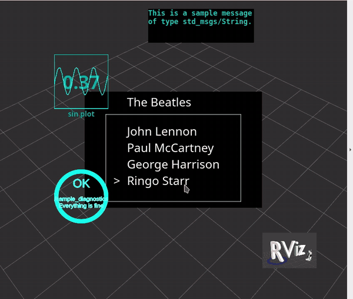
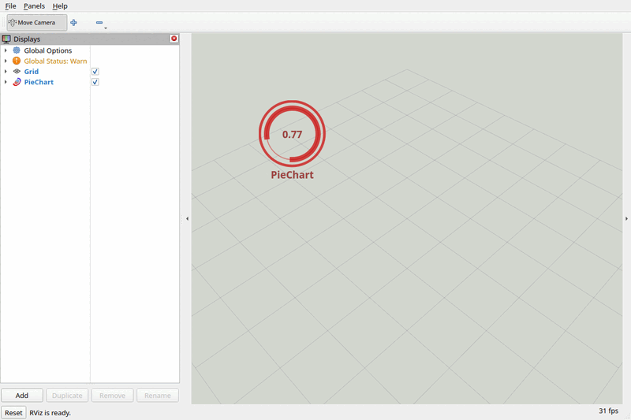
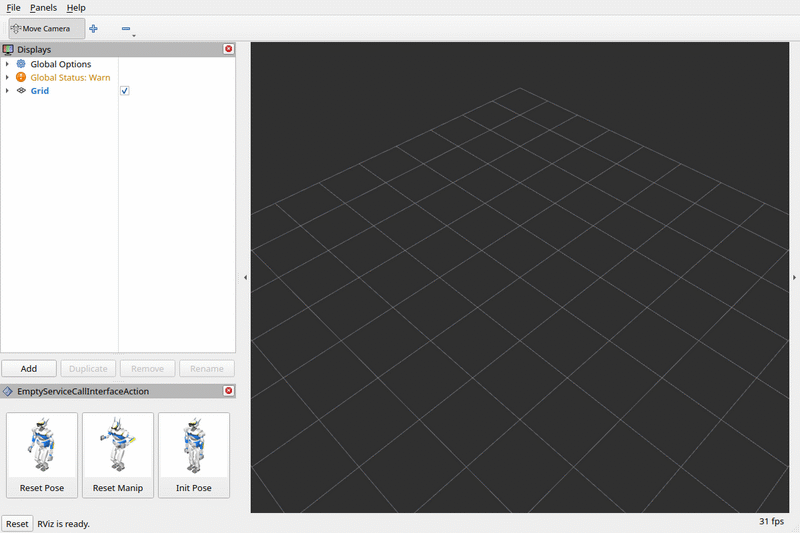
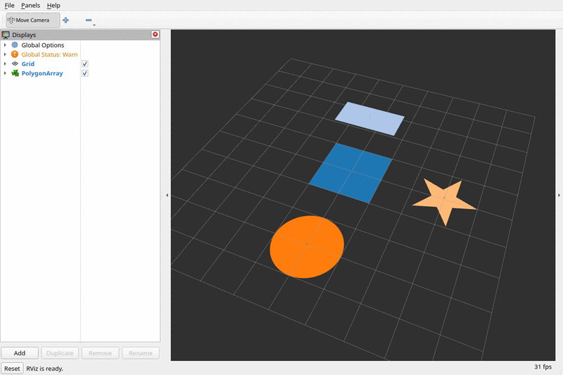
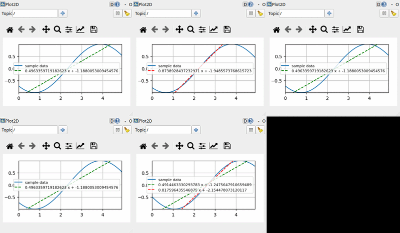
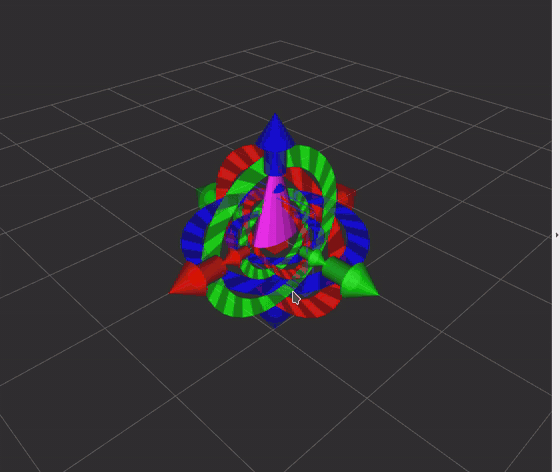

<!--
    DO NOT EDIT THIS FILE BY HAND.

    This file is automatically generated by generate_readme.py at 2026-11-18T23:58:20.049334.
-->

jsk\_visualization
=================

Visualization tools of the JSK Lab (the University of Tokyo) for ROS: rviz plugins, rqt plugins and interactive markers.

The same source tree builds for ROS 1 (catkin; rviz, rqt) and ROS 2 (ament;
rviz2, rqt), selected by `$ROS_VERSION`. The samples are launch files
(`roslaunch <pkg> <sample>.launch` on ROS 1,
`ros2 launch <pkg> <sample>.launch.py` on ROS 2) and scripts
(`rosrun` / `ros2 run`); the README of each package shows each sample on
ROS 1 and on ROS 2, with the commands to run it.

Gallery
-------

Click a sample to see how to run it.

### [jsk_rviz_plugins](jsk_rviz_plugins/README.md)

<table>
<tr>
<td align="center" valign="top" width="25%"> <a href="jsk_rviz_plugins/README.md#overlay_sample"><code>overlay_sample</code> OverlayText, String, Plotter2D, PieChart, OverlayImage, OverlayMenu, OverlayDiagnostic</a></td>
<td align="center" valign="top" width="25%"> <a href="jsk_rviz_plugins/README.md#pictogram_sample"><code>pictogram_sample</code> Pictogram, PictogramArray</a></td>
<td align="center" valign="top" width="25%"> <a href="jsk_rviz_plugins/README.md#linear_gauge_sample"><code>linear_gauge_sample</code> LinearGauge</a></td>
<td align="center" valign="top" width="25%"> <a href="jsk_rviz_plugins/README.md#piechart_sample"><code>piechart_sample</code> PieChart</a></td>
</tr>
<tr>
<td align="center" valign="top" width="25%"> <a href="jsk_rviz_plugins/README.md#robot_command_interface_sample"><code>robot_command_interface_sample</code> RobotCommandInterfaceAction</a></td>
<td align="center" valign="top" width="25%"> <a href="jsk_rviz_plugins/README.md#service_call_panel"><code>service_call_panel</code> EmptyServiceCallInterfaceAction</a></td>
<td align="center" valign="top" width="25%"> <a href="jsk_rviz_plugins/README.md#boundingbox_sample"><code>boundingbox_sample</code> BoundingBoxArray</a></td>
<td align="center" valign="top" width="25%"> <a href="jsk_rviz_plugins/README.md#polygon_array_sample"><code>polygon_array_sample</code> PolygonArray</a></td>
</tr>
<tr>
<td align="center" valign="top" width="25%"> <a href="jsk_rviz_plugins/README.md#segment_array_sample"><code>segment_array_sample</code> SegmentArray</a></td>
</tr>
</table>

### [jsk_rqt_plugins](jsk_rqt_plugins/README.md)

<table>
<tr>
<td align="center" valign="top" width="25%"> <a href="jsk_rqt_plugins/README.md#rqt_string_label"><code>rqt_string_label</code> StringLabel</a></td>
<td align="center" valign="top" width="25%"> <a href="jsk_rqt_plugins/README.md#rqt_status_light"><code>rqt_status_light</code> StatusLight</a></td>
<td align="center" valign="top" width="25%"> <a href="jsk_rqt_plugins/README.md#rqt_yn_btn"><code>rqt_yn_btn</code> YesNoButton</a></td>
<td align="center" valign="top" width="25%"> <a href="jsk_rqt_plugins/README.md#sample_image_view2"><code>sample_image_view2</code> ImageView2Plugin</a></td>
</tr>
<tr>
<td align="center" valign="top" width="25%"> <a href="jsk_rqt_plugins/README.md#sample_3dplot"><code>sample_3dplot</code> Plot3D</a></td>
<td align="center" valign="top" width="25%"> <a href="jsk_rqt_plugins/README.md#sample_service_buttons"><code>sample_service_buttons</code> ServiceButtons</a></td>
<td align="center" valign="top" width="25%"> <a href="jsk_rqt_plugins/README.md#sample_service_radio_buttons"><code>sample_service_radio_buttons</code> ServiceRadioButtons</a></td>
<td align="center" valign="top" width="25%"> <a href="jsk_rqt_plugins/README.md#sample_tabbed_buttons"><code>sample_tabbed_buttons</code> ServiceTabbedButtons</a></td>
</tr>
<tr>
<td align="center" valign="top" width="25%"> <a href="jsk_rqt_plugins/README.md#sample_drc_mini_maxwell"><code>sample_drc_mini_maxwell</code> DRCEnvironmentViewer</a></td>
<td align="center" valign="top" width="25%"> <a href="jsk_rqt_plugins/README.md#sample_histogram"><code>sample_histogram</code> HistogramPlot</a></td>
<td align="center" valign="top" width="25%"> <a href="jsk_rqt_plugins/README.md#sample_2dplot"><code>sample_2dplot</code> Plot2D</a></td>
</tr>
</table>

### [jsk_interactive_marker](jsk_interactive_markers/jsk_interactive_marker/README.md)

<table>
<tr>
<td align="center" valign="top" width="25%"> <a href="jsk_interactive_markers/jsk_interactive_marker/README.md#marker_6dof_sample"><code>marker_6dof_sample</code> marker_6dof</a></td>
<td align="center" valign="top" width="25%"> <a href="jsk_interactive_markers/jsk_interactive_marker/README.md#transformable_server_sample"><code>transformable_server_sample</code> transformable_server_sample</a></td>
</tr>
</table>
