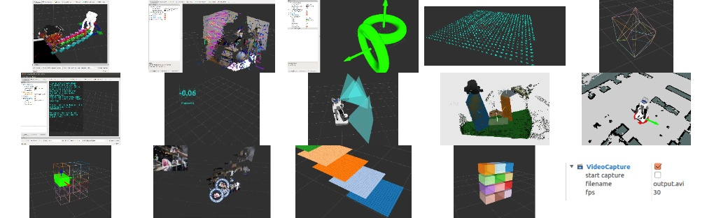

<!--
    DO NOT EDIT THIS FILE BY HAND.

    This file is automatically generated by /home/shingo/ros/kinetic/src/jsk-ros-pkg/jsk_visualization/generate_readme.py at 2020-04-04T19:02:37.843225.
-->

jsk\_visualization
=================

 

jsk visualization ros package.

See [read the docs](http://jsk-visualization.readthedocs.org/en/latest/).

Gallery
-------

### [jsk_rviz_plugins](http://jsk-docs.readthedocs.io/en/latest/jsk_visualization/doc/jsk_rviz_plugins)

### [jsk_rqt_plugins](http://jsk-docs.readthedocs.io/en/latest/jsk_visualization/doc/jsk_rqt_plugins)

Deb build status
----------------

[//]: # (!!DO NOT EDIT !!)

[//]: # (THIS SECTION IS AUTOMATICALLY GENERATED BY)

[//]: # (rosrun jsk_tools generate_deb_status_table.py jsk_visualization)

| Package                   | Kinetic (Xenial)                                                                                                                                                                                               | Melodic (Bionic)                                                                                                                                                                                               | Melodic (Stretch)                                                                                                                                                                                                | Noetic (Focal)                                                                                                                                                                                               | Noetic (Buster)                                                                                                                                                                                                |
|:--------------------------|:---------------------------------------------------------------------------------------------------------------------------------------------------------------------------------------------------------------|:---------------------------------------------------------------------------------------------------------------------------------------------------------------------------------------------------------------|:-----------------------------------------------------------------------------------------------------------------------------------------------------------------------------------------------------------------|:-------------------------------------------------------------------------------------------------------------------------------------------------------------------------------------------------------------|:---------------------------------------------------------------------------------------------------------------------------------------------------------------------------------------------------------------|
| jsk_visualization (arm64) |  |  |  |  |  |
| jsk_visualization (armhf) |  |  | ---                                                                                                                                                                                                              |  | ---                                                                                                                                                                                                            |
| jsk_visualization (i386)  |              | ---                                                                                                                                                                                                            | ---                                                                                                                                                                                                              | ---                                                                                                                                                                                                          | ---                                                                                                                                                                                                            |
| jsk_visualization (amd64) |            |            |      |            |      |

[//]: #
