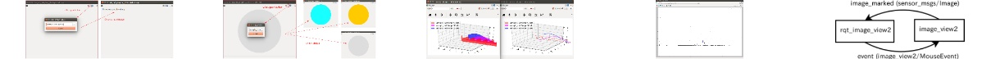

<!--
    DO NOT EDIT THIS FILE BY HAND.

    This file is automatically generated by /home/wkentaro/jsk_apc/src/jsk-ros-pkg/jsk_visualization/generate_readme.py at 2017-11-28T00:49:59.907481.
-->

jsk\_visualization
=================

 

jsk visualization ros package.

See [read the docs](http://jsk-visualization.readthedocs.org/en/latest/).

Gallery
-------

### [jsk_rviz_plugins](http://jsk-docs.readthedocs.io/en/latest/jsk_visualization/doc/jsk_rviz_plugins)

### [jsk_rqt_plugins](http://jsk-docs.readthedocs.io/en/latest/jsk_visualization/doc/jsk_rqt_plugins)

Deb build status
----------------

| Package                   | Indigo (Saucy)                                                                                                                                                                                             | Indigo (Trusty)                                                                                                                                                                                              | Jade (Trusty)                                                                                                                                                                                                | Jade (Vivid)                                                                                                                                                                                               | Kinetic (Wily)                                                                                                                                                                                           | Kinetic (Xenial)                                                                                                                                                                                               |
|:--------------------------|:-----------------------------------------------------------------------------------------------------------------------------------------------------------------------------------------------------------|:-------------------------------------------------------------------------------------------------------------------------------------------------------------------------------------------------------------|:-------------------------------------------------------------------------------------------------------------------------------------------------------------------------------------------------------------|:-----------------------------------------------------------------------------------------------------------------------------------------------------------------------------------------------------------|:---------------------------------------------------------------------------------------------------------------------------------------------------------------------------------------------------------|:---------------------------------------------------------------------------------------------------------------------------------------------------------------------------------------------------------------|
| jsk_visualization (arm64) |  |  |  |  |  |  |
| jsk_visualization (armhf) |  |  |  |  |  |  |
| jsk_visualization (i386)  |            |            |            |            |            |              |
| jsk_visualization (amd64) |          |          |          |          |          |            |
