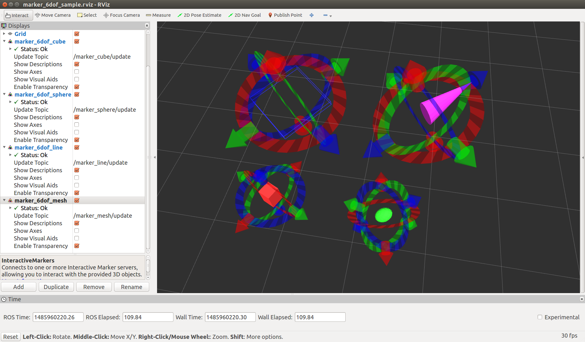

# marker_6dof



`marker_6dof` provides interactive marker to control a marker of primitive shape or mesh shape.


## Parameters

* `~object_type` (String, default: `sphere`)

   Type of object shape. cube, sphere, line, and mesh are available.

* `~frame_id` (String, default: `/map`)

   Frame id of marker.

* `~publish_tf` (Bool, default: `False`)

   Tf of marker pose is published if true.

* `~tf_frame` (String, default: `object`)

   frame id of published tf. This value is used only when `~publish_tf` is true.

* `~tf_duration` (Double, default: `0.1`)

   Time interval of published tf. This value is used only when `~publish_tf` is true.

* `~publish_pose_periodically` (Bool, default: `False`)

   Pose of marker is published periodically if true.
   Pose topic is published only when marker is moved via Rviz if false.

* `~object_x` (Double, default: `1.0`)
* `~object_y` (Double, default: `1.0`)
* `~object_z` (Double, default: `1.0`)

   X, Y, Z scale of object.

* `~object_r` (Double, default: `1.0`)
* `~object_g` (Double, default: `1.0`)
* `~object_b` (Double, default: `1.0`)
* `~object_a` (Double, default: `1.0`)

   Red, Green, Blue and Alpha value of object.

* `~initial_x` (Double, default: `0.0`)
* `~initial_y` (Double, default: `0.0`)
* `~initial_z` (Double, default: `0.0`)

   Initial X, Y, Z position of marker.

* `~initial_orientation` (Vector of Double, default: `[0.0, 0.0, 0.0, 1.0]`)

   Initial orientation of marker described in quaternion.


## Subscribing Topics

* `~feedback` (`visualization_msgs/InteractiveMarkerFeedback`)
* `~move_marker` (`geometry_msgs/PoseStamped`)

   You can control markers through topics above.


## Publishing Topics

* `~update` (`visualization_msgs/InteractiveMarkerUpdate`)
* `~update_full` (`visualization_msgs/InteractiveMarkerInit`)

   Current marker state

* `~pose` (`geometry_msgs/PoseStamped`)

   Pose of marker.
   You can select publishing policy via `~publish_pose_periodically`.

* `/tf` (`tf2_msgs/TFMessage`)

   Tf of marker pose. Available only when `~publish_tf` is true.


## Sample

```
roslaunch jsk_interactive_marker marker_6dof_sample.launch
```
