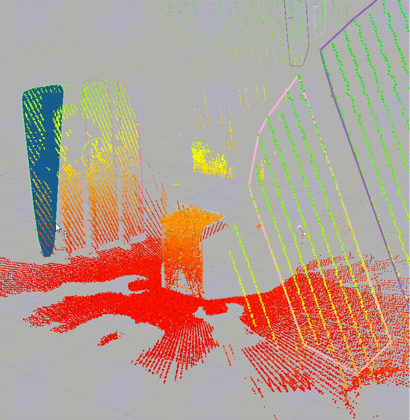
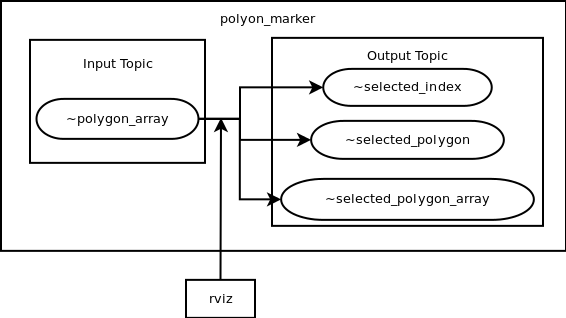

# polygon_marker

`polygon_marker` is a simple code to provide interactive marker to select
one polygon out of multiple polygons represented in [`jsk_recognition_msgs/PolygonArray`](http://docs.ros.org/indigo/api/jsk_recognition_msgs/html/msg/PolygonArray.html).

## Subscribing Topics
* `~polygon_array` (`jsk_recognition_msgs/PolygonArray`)

  Input polygons

## Publishing Topics
* `~selected_index` (`jsk_recognition_msgs/Int32Stamped`)

  Selected index of the polygon.
* `~selected_polygon` (`geometry_msgs/PolygonStamped`)

  Selected polygon as `geometry_msgs/PolygonStamped`
* `~selected_polygon_array` (`jsk_recognition_msgs/PolygonArray`)

  Selected polygon as `jsk_recognition_msgs/PolygonArray`.
