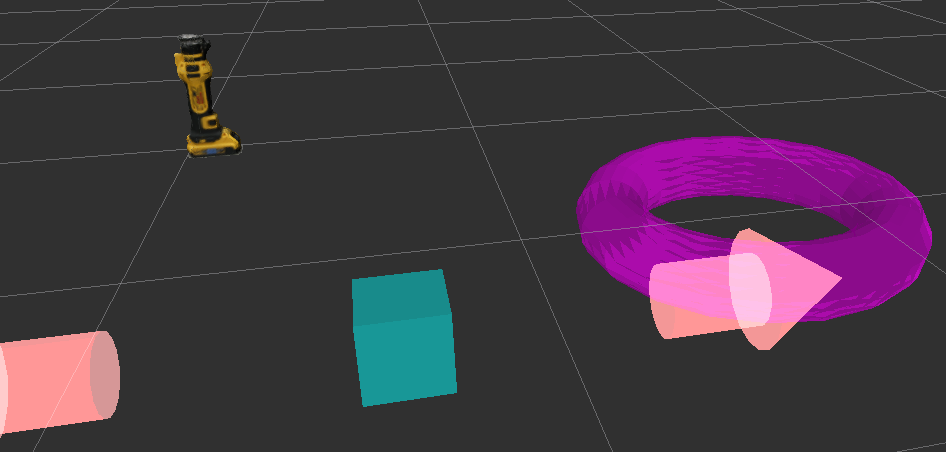

# transformable_server_sample



`transformable` provides interactive marker to control some object models.


## Parameters
* `~server_name`

  Name of interactive server.

* `~use_parent_and_child` (default: `false`)

  Flag for using `ParentAndChildInteractiveServer`.

  If true, you can use associate markers like below:

```bash
rosservice call /simple_marker/set_parent_marker "parent_topic_name: ''
parent_marker_name: 'drill'
child_marker_name: 'hand'"
```

  If `parent_topic_name==empty`, it uses self server,
  and only 1 hierarchy is supported.

* `~display_interactive_manipulator` (Bool, default: `true`)

  Flat to show the 6dof interactive manipulator for all objects.

* `~display_interactive_manipulator_only_selected` (Bool, default: `false`)

  Flag to show the 6dof interactive manipulator only for the selected object.
  This flag does nothing if `~display_interactive_manipulator` is `false`.

* `~display_description_only_selected` (Bool, default: `false`)

  Flag to show the description only for the selected object.


## Usage

```bash
roslaunch jsk_interactive_marker urdf_model_marker.launch
```

then, in different terminal
You can insert box marker by this command

```bash
rosservice call /simple_marker/request_marker_operate "operate: {type: 0, action: 0, frame_id: '', name: '', description: '', mesh_resource: '',
  mesh_use_embedded_materials: false}"
```

You can insert model by this command

```bash
rosservice call /simple_marker/request_marker_operate "operate: {type: 3, action: 0, frame_id: 'map', name: 'hand', description: '', mesh_resource: 'package://hrpsys_ros_bridge_tutorials/models/HRP3HAND_R_meshes/RARM_LINK6_mesh.dae',
  mesh_use_embedded_materials: true}" 
```


## Topics
You can control markers through topics below
(Please Read msg Structure by rosmsg show or some other)
(The default topic name is /simple_marker, server name is the same)
 * /simple_marker/set_color
 * /simple_marker/feedback [visualization_msgs/InteractiveMarkerFeedback]
 * /simple_marker/set_radius
 * /simple_marker/set_control_relative_pose
 * /simple_marker/add_pose_relative [geometry_msgs::Pose]
 * /simple_marker/set_z
 * /simple_marker/set_x
 * /simple_marker/set_y
 * /simple_marker/add_pose [geometry_msgs::Pose]
 * /simple_marker/set_control_pose [geometry_msgs::PoseStamped]
 * /simple_marker/set_pose [geometry_msgs::PoseStamped]

You can get marker info by topics below
 * /simple_marker/marker_dimensions [jsk_interactive_marker/MarkerDimensions]
 * /simple_marker/pose [geometry_msgs/PoseStamped]
 * /simple_marker/focus_object_marker_name [std_msgs/String]
 * /simple_marker/pose_with_name [jsk_interactive_marker/PoseStampedWithName]
 * /simple_marker/focus_marker_name_text [jsk_rviz_plugins/OverlayText]
 * /tf [tf2_msgs/TFMessage] (with marker name, tf is published)
 * /simple_marker/focus_marker_pose_text [jsk_rviz_plugins/OverlayText]


## Services
You can control markers through topics below
 * /simple_marker/request_marker_operate -> for inserting marker
 * /simple_marker/set_focus
 * /simple_marker/set_color
 * /simple_marker/set_control_pose
 * /simple_marker/set_parameters
 * /simple_marker/set_pose
 * /simple_marker/set_dimensions
 * /simple_marker/set_parent_marker
 * /simple_marker/hide

You can get marker info through topics below
 * /simple_marker/get_control_pose
 * /simple_marker/get_color
 * /simple_marker/get_focus
 * /simple_marker/get_dimensions
 * /simple_marker/get_type
 * /simple_marker/get_pose
 * /simple_marker/get_existence
