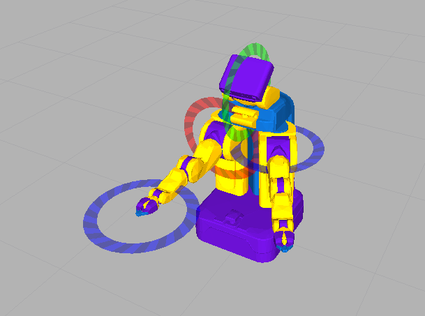

# urdf_model_marker


`urdf_model_marker` provides interactive marker to control robot model.

## Parameters
* `~server_name`

  Name of nteractive server.
* `~use_dynamic_tf` (default: `true`)

  Use `dynamic_tf_publisher` if it is true.
* `~model_config`

  Collection of parameters.
  * `name`
  * `description`
  * `scale`
  * `pose`
  * `offset`
  * `use_visible_color`
  * `frame-id`
  * `registration`
  * `fixed_link`
  * `model`
  * `use_robot_description`
  * `model_param`
  * `robot`
  * `mode`
  * `initial_joint_state`
    * `name`
    * `position`
  * `display`

## Sample

```
roslaunch jsk_interactive_marker urdf_model_marker.launch
```
