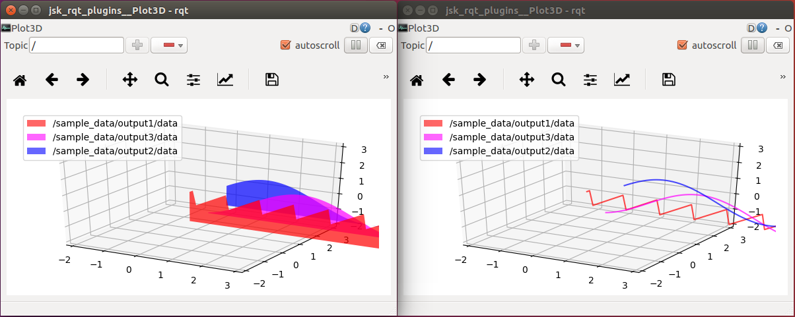

rqt\_3d\_plot
=============



Plot multiple topics in 3-dimentional layout.


Topic Type
----------

* numeric data such as `std_msgs/Float32`


Optional Arguments
------------------

* `-P`, `--pause`: Start in paused state.

* `-L`, `--line`: Show lines rather than polygon representation.

* `--no-legend`: Do not show legend.

* `-B`, `--buffer`: The length of the buffer. (default = 100)


Sample
------

```
$ roslaunch jsk_rqt_plugins sample_3dplot.launch
```
