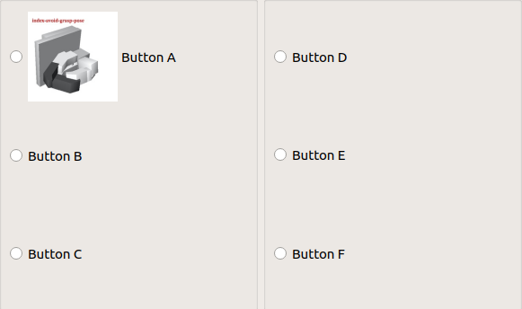

# rqt\_service\_radio\_buttons


Generate service buttons according to the configuration written in yaml file.

- sample yaml file: `jsk_rqt_plugins/resource/service_radio_button_layout.yaml`
- sample perspective file: `jsk_rqt_plugins/resource/rqt_service_radio_buttons.perspective`

## Sample

```bash
roslaunch jsk_rqt_plugins sample_service_radio_buttons.launch
```
