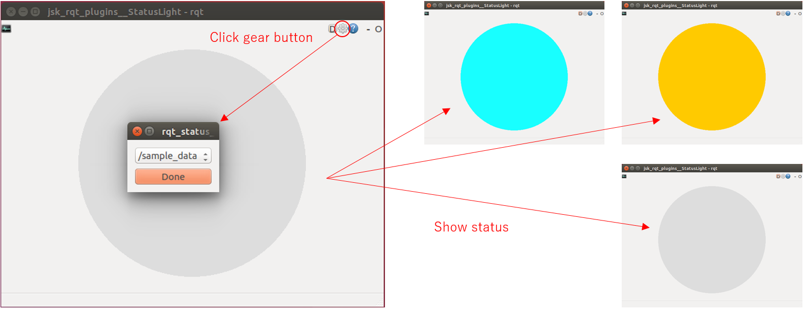

rqt\_status\_light
==================





Subscribe specified topic and show status in a simple color.


Topic Type
----------

* `std_msgs/UInt8`


Correspondence between Value and Color
--------------------------------------

* `1`:       green
* `2`:       yellow
* `(other)`: gray


Usage
-----

```
$ rosrun jsk_rqt_plugins rqt_status_light
$ rostopic pub -r 10 /sample_data std_msgs/UInt8 1  # Select /sample_data in window here
```
