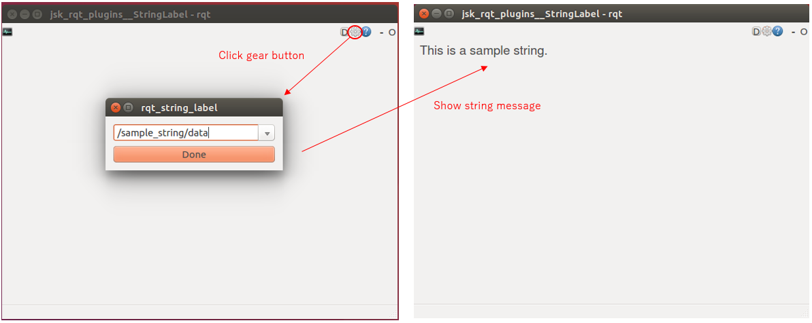

rqt\_string\_label
==================





Subscribe string under specified topic and show the string message.


Topic Type
----------

* Any topic type which has `string` slot


Usage
-----

```
$ rosrun jsk_rqt_plugins rqt_string_label
$ rostopic pub -r 10 /sample_string std_msgs/String 'This is a sample string.'  # Select /sample_string/data in window here
```
