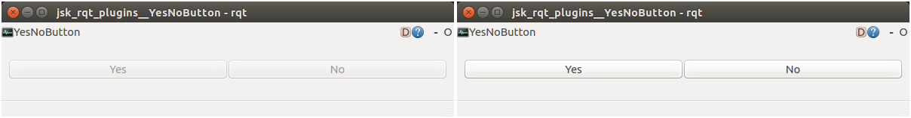

rqt\_yn\_btn
============





Serves yes/no buttons. The buttons are enabled when there is a request.


Advertising Service
-------------------

* `rqt_yn_btn` ([`jsk_rqt_plugins/YesNo`](http://docs.ros.org/indigo/api/jsk_rqt_plugins/html/srv/YesNo.html))


Usage
-----

```
$ rosrun jsk_rqt_plugins rqt_yn_btn rqt_yn_btn:=yes_no
$ rosservice call /yes_no "Select Yes or No"  # push button here
yes: True
```
