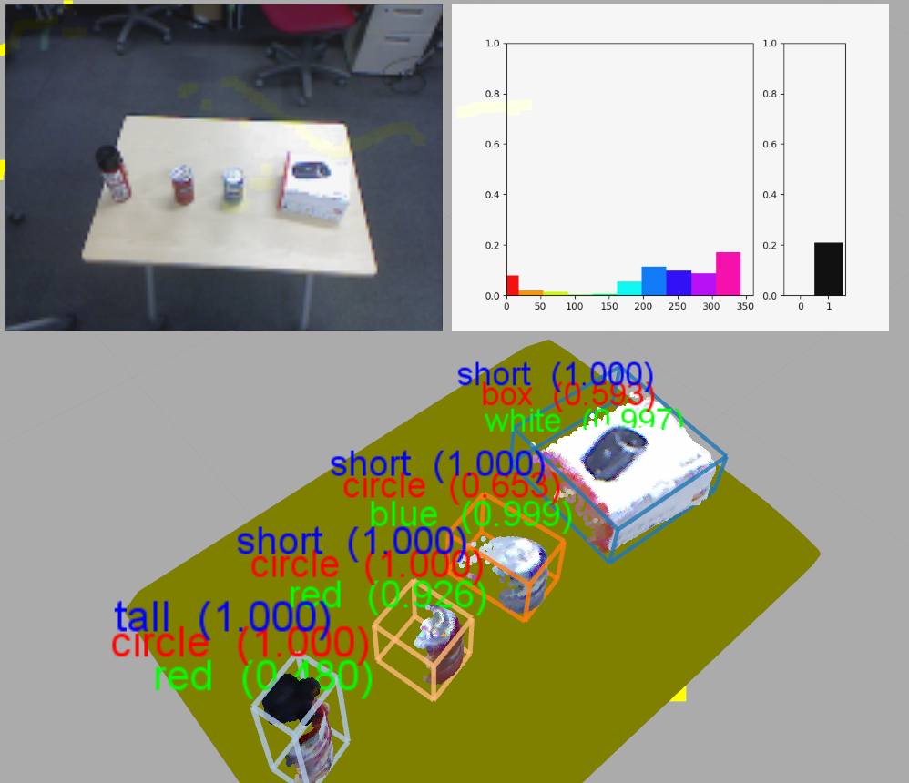

classification_result_visualizer.py
===================================

What is this?
-------------

Publish classification results as text markers for each classified object.

The ``ClassificationResult`` is synchronized with one topic which represents poses for each classified object / person.

Subscribing Topic
-----------------

* ``~input/classes`` (``jsk_recognition_msgs/ClassificationResult``)

  Classification result

* ``~input/boxes`` (``jsk_recognition_msgs/BoundingBoxArray``)

  Bounding boxes of classified objects

* ``~input/poses`` (``geometry_msgs/PoseArray``)

  Poses of classified objects

* ``~input/people`` (``jsk_recognition_msgs/PeoplePoseArray``)

  Poses of classified people

* ``~input/ObjectDetection`` (``posedetection_msgs/ObjectDetection``)

  Poses of classified objects

Publishing Topic
----------------

* ``~output`` (``visualization_msgs/MarkerArray``)

  Text message markers

Parameters
----------

* ``~appriximate_sync`` (Bool, Default: ``false``)

  Option to enable approximate synchronization

* ``~queue_size`` (Int, Default: ``100``)

  Queue size of subscribers on synchronization

* ``~slop`` (Double, Default: ``0.1``)

  Slop duration on approximate synchronization

* ``~text_color_blue`` (Double, Default: ``1.0``)

  Blue of text color

* ``~text_color_green`` (Double, Default: ``0.0``)

  Green of text color

* ``~text_color_red`` (Double, Default: ``0.0``)

  Red of text color

* ``~text_color_alpha`` (Double, Default: ``1.0``)

  Alpha of text color

* ``~text_offset_x`` (Double, Default: ``0.0``)

  Text offset on x-axis for each object

* ``~text_offset_y`` (Double, Default: ``0.0``)

  Text offset on y-axis for each object

* ``~text_offset_z`` (Double, Default: ``0.07``)

  Text offset on y-axis for each object

* ``~text_size`` (Double, Default: ``0.05``)

  Text size

* ``~marker_lifetime`` (Double, Default: ``5.0``)

  Marker lifetime

* ``~show_proba`` (Bool, Default: ``true``)

  Enable to display probability for each classification
