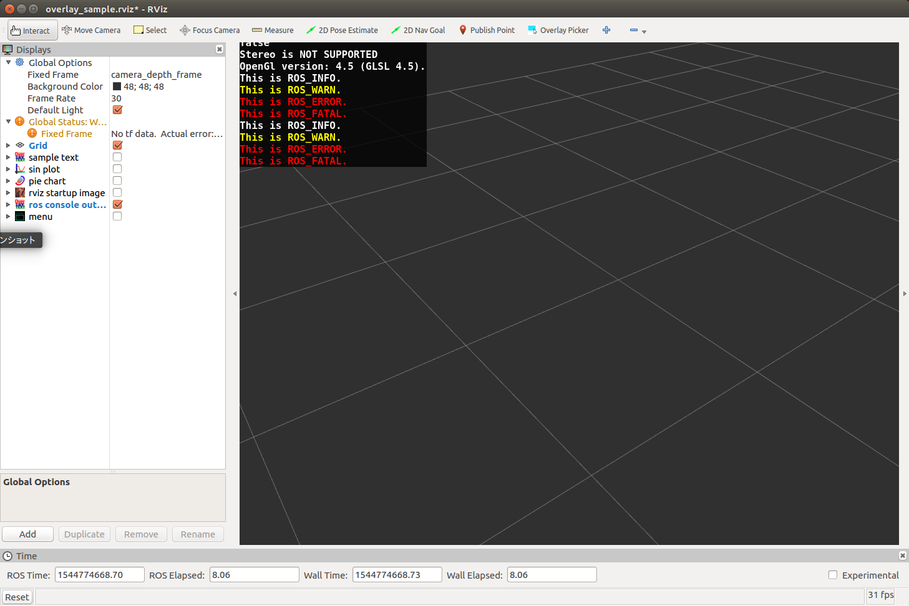

rosconsole_overlay_text.py
==========================

What is this?
-------------

Publish message for overlaying ROS console output on rviz.

Subscribing Topic
-----------------

* ``/rosout`` (``rosgraph_msgs/Log``)

  ROS console output.

Publishing Topic
----------------

* ``~output`` (``jsk_rviz_plugins/OverlayText``)

  Text message displayed on rviz with OverlayText plugin.

Parameters
----------

* ``~nodes`` (List of String, Default: ``[]``)

  Node names whose messages will be published.
  If an empty list is specified (default), then messages from all nodes will be published.

* ``~nodes_regexp`` (String, Default: ``""``)

  Regular expression used to filter unmatching nodes.
  If an empty string is specified (default), then messages from all nodes will be published.

Note that the combination of ``~nodes`` and ``~nodes_regexp`` is ``AND`` filter.

* ``~ignore_nodes`` (List of String, Default: ``[]``)

  Node names whose messages won't be published.
  This parameter takes priority over ``~nodes`` or ``nodes_regexp``.

* ``~exclude_regexes`` (List of String, Default: ``[]``)

  Regular expressions used to exclude matching messages.

* ``~line_buffer_length`` (Int, Default: ``100``)

  Max number of messages stored in buffer.

* ``~reverse_lines`` (Bool, default: ``True``)

  If True, the order of stored messages in the buffer will be reversed.

Sample
------

.. code-block:: bash

  roslaunch jsk_rviz_plugins overlay_sample.launch
