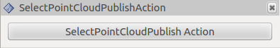

# SelectPointCloudPublishAction

This will publish sensor_msgs/PointCloud2 to /selected_pointcloud.
1. First, push `Select`Button and select the pointcloud region(Note that you need to choose only pointcloud. Don't include other parts).
2. Secord, push the SelectPointCloudPublishAction button.
3. Then the selected pointcloud will be published.
