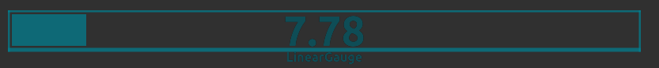

# LinearGauge
Plot a linear gauge of `std_msgs/Float32` on rviz as HUD overlay.



To change caption text, please [rename plugin display name](http://docs.ros.org/jade/api/rviz/html/user_guide/#naming-displays) on rviz Displays tab

It can increase in either horizontal or vertical direction

## Sample
```
roslaunch jsk_rviz_plugins linear_gauge_sample.launch
```
