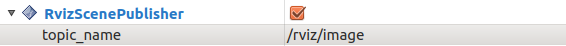

RvizScenePublisher
==================

What is this?
-------------

RvizScenePublisher plugin can publish ``sensor_msgs/Image`` of rviz.

.. image:: images/rviz-scene-publisher.gif

Publishing Topic
----------------

* ``/rviz/image`` (``sensor_msgs/Image``)

  Scene of rviz image. You can change the topic name by changing ``topic_name`` in Displays.

