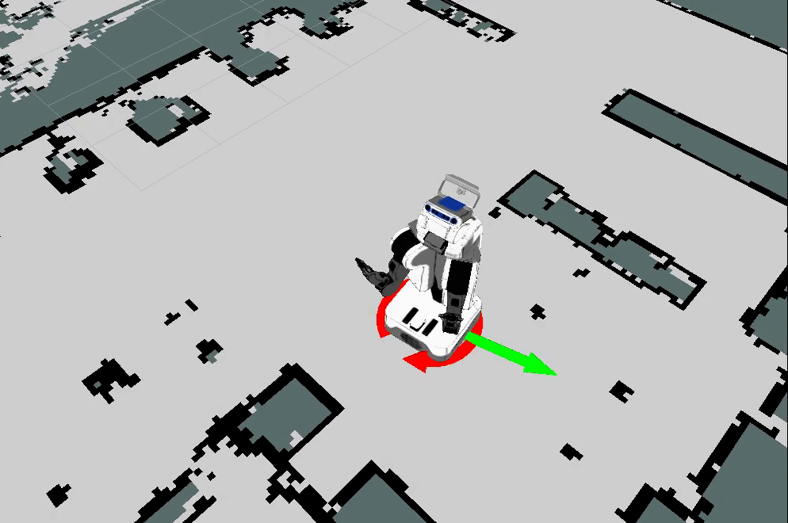

# [TwistStamped](http://youtu.be/Q-I5Vx_4VHk)

[Movie](http://youtu.be/Q-I5Vx_4VHk)

Visualize `geometry_msgs/TwistStamped` by arrows. Linear velocity is represented by one arrow
and angular velocity is represented by 3 arrows for each axis.

## Properties
* linear scale (default: `1.0`)
* angular scale (default: `1.0`)

  Scale factor of size of arrows

* linear color (default: `RGB(0, 255, 0)`)
* angular color (default: `RGB(255, 0, 0)`)

   Color of arrows
