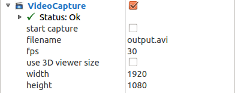

# VideoCapture
VideoCapture plugin can capture video of rviz.

You need to specify valid filename and fps before capturing video.
You can also specify width and height of video manually instead of using 3D viewer size if you want.
After that, toggle start capture checkbox and the movie will be recorded until you uncheck the checkbox.

Be careful on creating too large video.
