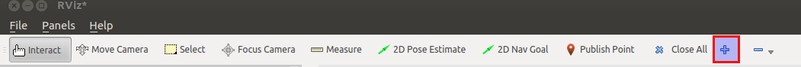
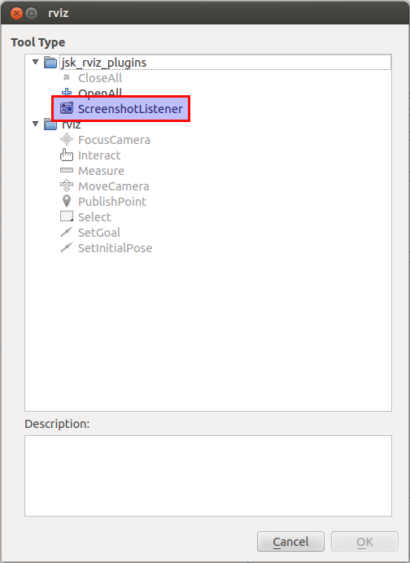

# ScreenshotListenerTool
It is a tool to take screenshot of rviz via service interface.

Click "add button" of toolbar on rviz and you will see popup to add tools.





And `/rviz/screenshot` service will be available.

You can save screenshot via service call:
```
$ rosservice call /rviz/screenshot foo.png
```
