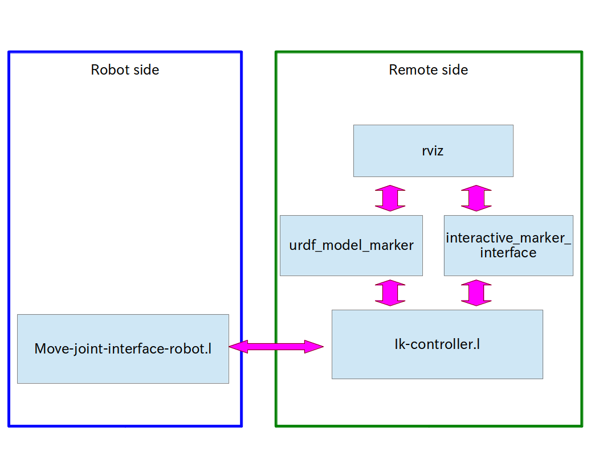

jsk_interactive_markers
=======================

## How to use jsk interactive markers
### in robot
```
rosrun roseus roseus `rospack find jsk_interactive`/euslisp/move-joint-interface-robot.l
```
or
```
roslaunch jsk_pr2_startup pr2_teleop_robot.launch
```
The latter includes the former and other nodes for teleoperation.

### in remote PC
```
roslaunch jsk_interactive_marker jsk_interactive_marker_controller_remote.launch
```
or
```
roslaunch jsk_pr2_startup pr2_teleop_remote.launch
```
The latter includes the former and other nodes for teleoperation.

#### To move with joystick
```
roslaunch jsk_teleop_joy pr2_remote.launch DEV:=/dev/input/js0
```

## System description

### Control of model robot

#### Joint Control
Click robot interactive marker in rviz and move joint.
#### Hand Control
Move hand interactive marker in rviz.

### Control of real robot
When "Move" is selected with mouse or joystick, sensor_msgs/JointState is send to move-joint-interface.l .  

move-joint-interface.l controls a real robot.


## Node description
### interactive_marker_interface
Control hand pose with 6-DOF interactive marker.

### urdf_model_marker
Make interactive marker from urdf.
