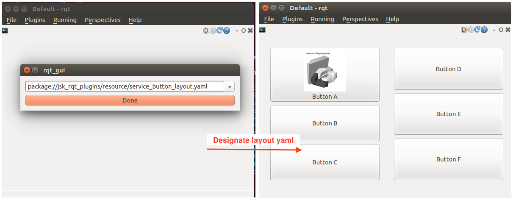

# jsk\_rqt\_plugins

### rqt\_service\_button

Generate service buttons according to the configuration written in yaml file.
(sample yaml file: `jsk_rqt_plugins/resource/service_button_layout.yaml`)